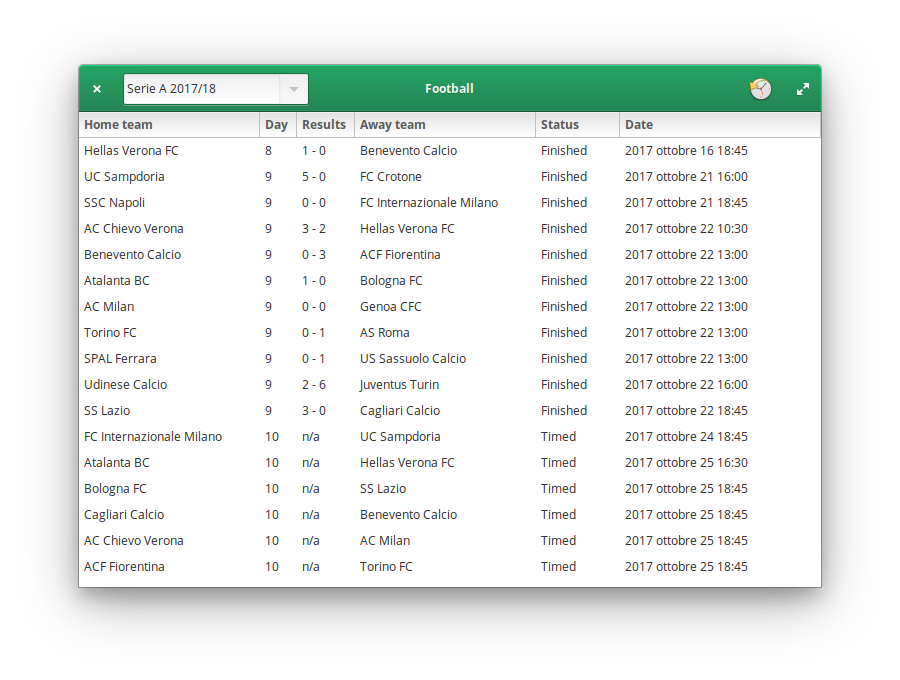

# Football
A Football competitions control application for elementary OS



## Requirements
- python3 (you can also run this program on python2.x, installing **requests** from **pip**)
- libgtk-3-dev
- libgranite-dev

## How to install
Grab a copy [here](https://github.com/mirkobrombin/Football/archive/master.zip) or use **git**  

```bash
git clone https://github.com/mirkobrombin/Football.git  
cd Football  
sudo make install
```

## How to run
```bash
com.github.mirkobrombin.Football
```

## How to run (without install)

```bash
sudo apt install python3 libgtk-3-dev libgranite-dev 
cd src
python3 main.py
```
